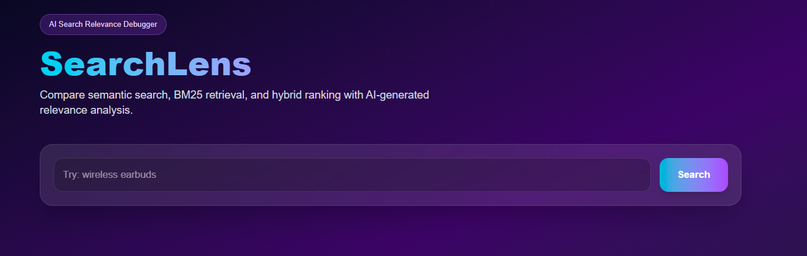
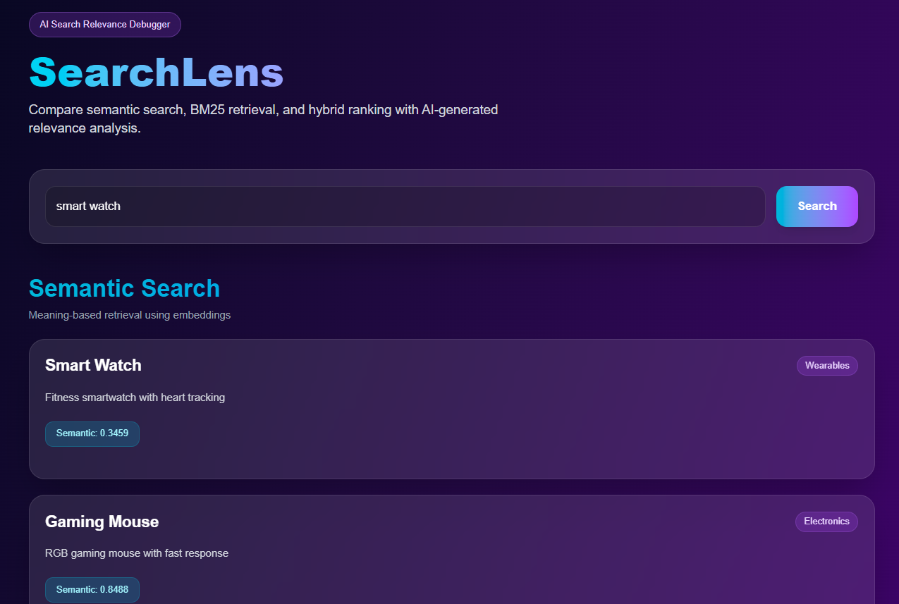
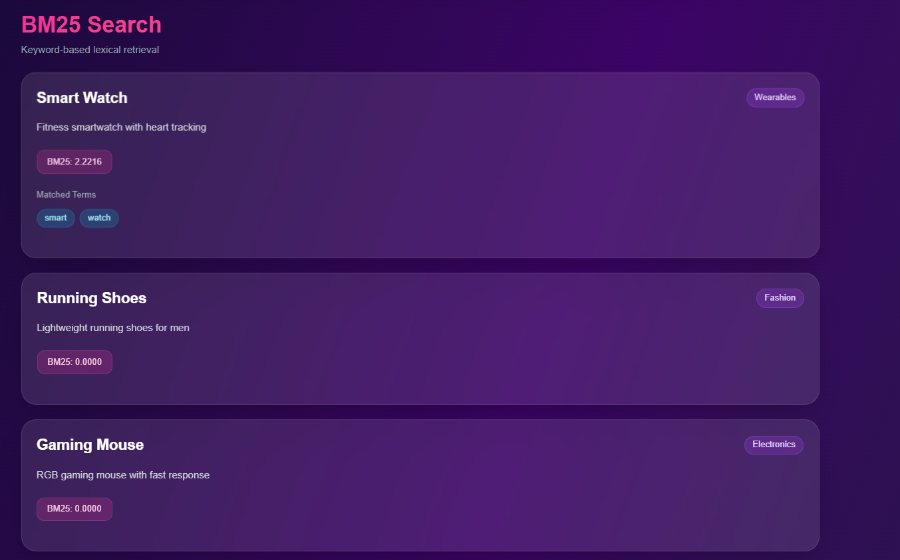
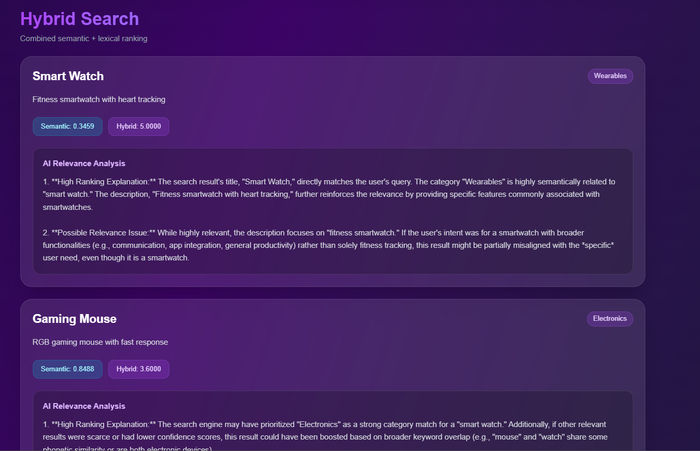

# SearchLens — AI Search Relevance Analyzer

SearchLens is an AI-powered search relevance debugging tool that helps product and search teams understand why specific search results rank highly.

The platform compares semantic retrieval, BM25 keyword retrieval, and hybrid ranking side-by-side while generating AI explanations for ranking behavior and possible relevance issues.

---

# Why I Built This

While working on search and discovery systems, I often found that debugging poor search relevance was surprisingly difficult. When a query returned irrelevant results, understanding *why* something ranked highly required manually inspecting token matches, semantic similarity, ranking logic, and multiple retrieval pipelines.

I wanted a lightweight tool that makes retrieval systems more observable and explainable instead of treating search ranking as a black box.

The smallest useful version of this idea was:
- upload/search a product catalog
- compare retrieval methods
- generate ranking explanations
- identify obvious ranking failures

This MVP focuses on exactly that.

---

# Features

- Semantic Search using embeddings
- BM25 keyword retrieval
- Hybrid ranking pipeline
- AI-generated ranking explanations using Gemini
- Search result comparison dashboard
- Retrieval debugging metrics
- Modern frontend visualization

---

# Demo

## Search Dashboard



## Seamntic Search



## BM25 Search



## Hybrid Retrieval Comparison



# Tech Stack

## Backend
- FastAPI
- FAISS
- Sentence Transformers
- BM25
- Gemini API

## Frontend
- Next.js
- TailwindCSS
- Axios

---

# Architecture Overview

```text
User Query
    ↓
Semantic Retrieval (FAISS)
    ↓
BM25 Retrieval
    ↓
Hybrid Ranking
    ↓
Gemini Explanation Layer
    ↓
Frontend Dashboard
```

---

# Architecture Decisions

## Why BM25 + Semantic Search Instead of Only Embeddings?

Pure semantic search often misses exact keyword intent, while BM25 struggles with semantic similarity.

I used hybrid retrieval because production search systems usually combine lexical and semantic ranking to balance precision and recall.

---

## Why FAISS Instead of Elasticsearch?

For the MVP, FAISS was significantly lighter and easier to deploy locally. Elasticsearch would add operational complexity without improving the core demonstration.

---

## Why Precomputed Embeddings?

Generating embeddings during deployment increases RAM usage and startup latency.

I chose offline embedding generation using `ingest.py` so the deployed backend only handles retrieval and ranking.

This made deployment lightweight and reproducible.

---

## Why Gemini Instead of Hosting Open Models?

Initially I explored running open-source models using GPU infrastructure, but for a 2–3 day MVP, Gemini provided:
- faster iteration
- lower operational overhead
- simpler deployment
- better reliability

The architecture still supports replacing Gemini with self-hosted models later.

---

## Why Hybrid Score Fusion?

Instead of relying entirely on one retrieval strategy, I combined semantic and BM25 ranking scores to improve ranking robustness.

This mirrors real-world retrieval systems where hybrid ranking often outperforms individual retrievers.

---

# What I Used AI For

## AI-Assisted
- frontend UI scaffolding
- Tailwind styling iterations
- boilerplate API setup
- debugging dependency issues
- README refinement

## Written/Modified Manually
- retrieval architecture
- hybrid ranking logic
- BM25 integration
- retrieval debugging flow
- ranking explanation pipeline
- backend integration
- overall product design

## Where I Overrode AI Suggestions

I intentionally avoided:
- heavy LangChain abstractions
- large GPU-hosted models for MVP
- overengineered agent systems
- runtime embedding generation

because they increased operational complexity without improving the smallest useful version of the product.

---

# How To Run

## Backend

```bash
cd backend

python -m venv venv
```

### Activate venv

#### Windows
```bash
venv\Scripts\activate
```

#### Mac/Linux
```bash
source venv/bin/activate
```

### Install dependencies

```bash
pip install -r requirements.txt
```

### Generate embeddings + FAISS index

```bash
python ingest.py
```

### Start backend

```bash
uvicorn main:app --reload
```

Backend runs on:
```text
http://127.0.0.1:8000
```

---

## Frontend

```bash
cd frontend
```

### Install dependencies

```bash
npm install
```

### Start frontend

```bash
npm run dev
```

Frontend runs on:
```text
http://localhost:3000
```

---

# Example Queries

Try:
- wireless earbuds
- cheap audio devices
- gaming accessories
- fitness watch

---

# What I Would Change With 4 More Weeks

If I continued this project, I would add:

- retrieval evaluation benchmarks
- click-feedback learning
- reranking models
- search analytics dashboard
- dataset upload pipeline
- query intent classification
- semantic drift detection
- real production datasets
- OpenSearch/Elasticsearch backend
- self-hosted open-source LLM support
- A/B testing for ranking strategies

I would also improve retrieval explainability by exposing token-level matching and ranking feature contributions.

---

# Deployment

The architecture is deployment-friendly because embeddings are generated offline and the backend performs lightweight inference-only retrieval.

Frontend can be deployed on:
- Vercel

Backend can be deployed on:
- Railway
- Render

---

# Project Structure

```text
searchlens/

backend/
│
├── data/
│   └── products.csv
│
├── ingest.py
├── main.py
├── search.py
├── requirements.txt

frontend/
│
├── app/
├── package.json

README.md
```

---

# Future Direction

This MVP focuses on making search ranking behavior explainable.

The longer-term goal would be building a complete search observability platform for debugging retrieval quality, ranking regressions, and semantic search failures in production systems.